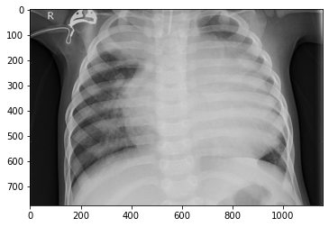
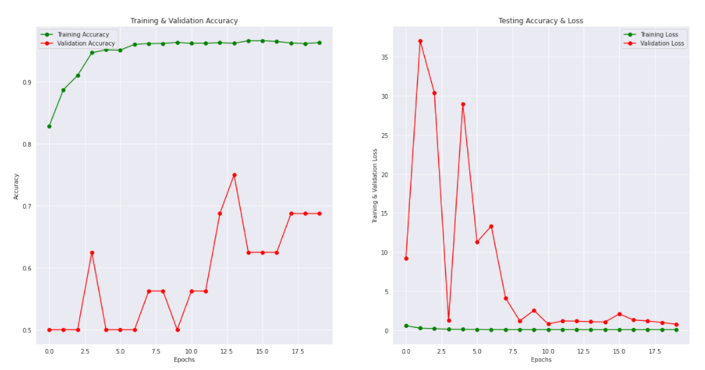
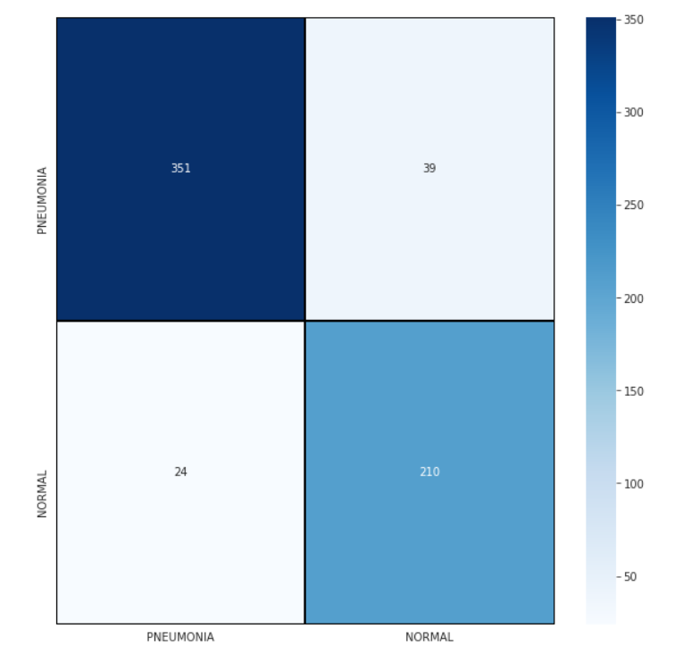
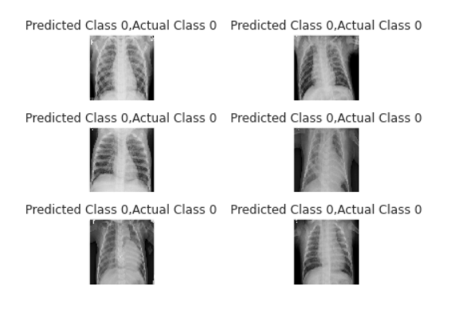

# pneumonia_detection_app
This is the my course project of Signal and image processing subject which I did in my second year.

# Description
## Technology - Deep Learning and Web development 
## Domain - Healthcare
## Languages used - html,css,javascript and python
## Framework - Flask and Bootstrap
## Deployment Server - Heroku
### What is Pneumonia?
Pneumonia is an inflammatory condition of the lung affecting primarily the small air sacs known as alveoli.Symptoms typically include some combination of productive or dry cough, chest pain, fever and difficulty breathing. The severity of the condition is variable. Pneumonia is usually caused by infection with viruses or bacteria and less commonly by other microorganisms, certain medications or conditions such as autoimmune diseases.Risk factors include cystic fibrosis, chronic obstructive pulmonary disease (COPD), asthma, diabetes, heart failure, a history of smoking, a poor ability to cough such as following a stroke and a weak immune system. Diagnosis is often based on symptoms and physical examination. Chest X-ray, blood tests, and culture of the sputum may help confirm the diagnosis.The disease may be classified by where it was acquired, such as community- or hospital-acquired or healthcare-associated pneumonia.

![](data:image/jpeg;base64,/9j/4AAQSkZJRgABAQAAAQABAAD/2wCEAAoHCBUVFBcVFRUXGBcYGhcbGxoaGh4dGhsaHRoaGxoaHBgbICwkGx0pIBsbJTYlKy4wMzMzGiI5PjkzPSwyMzABCwsLEA4QHhISHTIpIikyMjI0MjI8MjIyMDIyNDIyMjM7MjIyMDIyOzIyMjIyMjIyMjIyMjIyMjIyMjQyMjIyMv/AABEIAMABBgMBIgACEQEDEQH/xAAbAAACAwEBAQAAAAAAAAAAAAAABAMFBgIBB//EAD0QAAEDAgMFBgQDBwQDAQAAAAEAAhEDIQQSMQVBUWFxBhMiMoGRobHB8EJi0RQVI1JyouEzgpLxBySyFv/EABoBAQADAQEBAAAAAAAAAAAAAAABAgMEBQb/xAAqEQADAAICAQIFAwUAAAAAAAAAAQIDESExBBJBIjJRYXETgcEFFJGx8P/aAAwDAQACEQMRAD8A+zIQhACEIQAhCEAIQhACEIQAhCEBRdsj/wClWsTZtgYLvG3wgyInTUaqhpNr0HPqUMMcMx7sNRbTrPDwXvrZX1clKo4Nhjho4F0X0BWyxmFZVYWPEtdEiSNCCLi+oCMVhW1A0OEhrmPFyPExwc024ECyAyGI7R4ppbRAaajTiM724erUa7unsY0ClTeXU82cS4uIGWwM2fodoajmOeWBh/aMHTyOBzNbWZh3ODr+cGq4egsrDF9nsPUu5jgZe7MypUY7+JHeNLmOByOytlsx4RawQ/s7hjUFTuyHNNMhrXvbTzU47t3dtcGFzQAASJgRogM4/tBju77wHDQcNVxIHdvkCk5oNMnvbl4cDmtlg2crA7axGbvf4fcGsaAZld3gIlveZ80EZx5cvlvM2Vx+5KGTJ3fh7p9GMzv9N8ZmzM3yi+vNcfuDD9732R2bWM78mbLkz91myd5ltmiY3oDOU9tYhzKRrii7vRgKrAxr25O9xFNjmk94c5GYEOsJFwQndi7fq1cUKTix9N7Kz2uZSqMa3u302gNqvOWuCKl3NAEttra5/cdCKbclqbaTWeJ1m0ntfTGt4cxpvrF5UeA7P4ei9r6bHBzWvayalRwY15BcxjXOIYyWt8IAAgQgLhCEIAQhCAEIQgBCEIAQhCAEIQgBCEIAQhCAEIQgBCEIAQhCAjqvytJ4BUR2tUZUYHtzU3kNLmi9Nx0LgPwHjuR2qxr6TGFjcwDgXj8sEX4C+u6AutjVWV2525o3yIjlOhPRE+SXDa2XwXq8AXqEAhCEAIQhACEIQAhCEAIQhAJYjaFNjmsc7xuBIaNYGpjgmmukSN6oKmBDKlSpBL3kZnEzYWaBwbyG+U7sfHNqZ2AyaZAPrf4XCl69gpetstUIQoAIQhACEIQAhCEAIQhACEIQHijdVaNSu1gf/IFXF/wqeH70Nc55e6nmzSC3I0uZdrYJPOOSmVt6K1SmXT9jV4zbNGk4NfUpMLvLneG5uYB1HNP0qmYSvj+K2PXrEVKlOqX5QHOLCScohtugHrJWg2JtzE0e6oVMLV7sZaZqNDyWiYa4jLBAsOgWlY9LaezHH5Ct6ctfRn0SVW7U2xTo5Q43cY5DmSqjaDsR39MgPfTEhzWcb3I00IN+Cb2jsxr6cVGiCRAHmB4zuKx2dfpSfI1RplzpJubzwC42ptEYfu2hlnOOaAfCyzS85RaHuZJMCCbqPZ+EGGoPLA55aCQDdxDROVoA11gDekDtLGPLT3OTwuzNcxzwXNIBGYAQ0w+OILT1EV2T/wD6xgyhzHyQ7NEQHNAJEk6eJpng4J3ZG1+/fVGWAzLGh1F/EDBuDpaIO9JYrF1mVXHuy+nEMaKZOV3dg+ZoJMuJad0dEzsPFVHl3eMLAGU4BYW3moD4iAHSAwwLDMApKl4hCEB4qva+0X0suSkahM6OAj6lWiotu4kse0AAyDa86/lDj/b6oWlbZPsjadSrIfRNMgSPECD6WIVsqPZOILngEAeAmLzq3+YNI/4+qvEFLTPUIQhUEIQgENq4AVmFmZzDuLTHoeI5Kq2TgG4SQ0Ez5ydTw9BuWjVZtova3NTYHu0ykxIOh5wd3NRotLfRYU6gcJBkLtZLYVGswvqVXQ95Hh/CI6W4W3AKybt0Ct3Lm3y5szTI0mCN1r67wmw554LtcPeBqQOqX/ap8vqSPouJJknX7hGyVDfY6HSvUi1xBMGPTemKNSddRr+qJkVLROhCFJUEIQgBCEIDkpFgvfh8d6fUL6IN7joqtbJTK+u5RUqWYgz/AN7lPWwhJvm9Lg/oUxTwp3mJ1gX6Suf9Kne30bKlKJsOPCOYn3uqvtDtAUhTLmktLjJG4gCNepVs54aANOA/wk6wDyDuExz6z0XSzOVt7JNl1c9Jj4IzSQDrBJifSE4k6VbKMpkxoQN3PmmmPBEhERSaZ2hCFJU8QuH1ANVH+0ckJUtk6znafzU5iCHakRu3OcAfYrQMqA6Kh7TWNM3FnSZI/l1OZo93eh3Qy0dnOwD47RGQ6RGrdzTA/wCIWjWc2EZeLz4DeZGrd+Z4+I6HdoS6NUQydnSEucRyXTawOtvvipI9LJ0LxeoVPFBivIeV/YypKj4ErPbX7RUaJcx72mqGOeKY8zoBIHCTFpT8Er6ss8A4S5p5HqvGbHpNe57G5XO1I/Q6eiw+x+3T3OecSxtNgGZjmBzspmA0i5dM6iOi2uy9qMrMbUpvD6btCLEHSCN17QbhTUOe0ROSb5hkgYWkixGs6RbgpF1VaQSYJB4cdPoow6+8dbKjN5e0ehS4QebjPw3fNRNBJgRz5FNUqcDnvRFbfGiVCEKxkCEIQAhCEAIQhACEIQCNU+Iz6dP+5Xi6q+czyjpH6yuZVGbz0Clwv4ju+o1Py9lCXAFMYYEAk2k/QKURfROoKtaLD3XGIrxPAan6KorbRaCoqkicWGr9iwL14HJGljWuI5pxhUJ7NqxueGidjoIP3G9VnaUXpkTPj0Bn8O8NJHuFYBV/aUS2n1NoB3Ddld8G+oVl0YUviRxsSe8BMzkNzPFu9wn+49Fc4l149VS7CEVNIOQ7o3t3ZWE+x9N9tiD4j6fIJ7DW7Iy9AcoyUNcqm+hqlXjXT4hNNINwqwuQzEFp5bx+nNSqMqxb5Q9ivLzkR1Xyfavct2jVeKjjUkWLRlY/I0AZibtFt3JfWKniaCL6ELI7T7G0auI/aD3jHEgva2MriIAJkW0Ewd3qtsdKa2zlyxVTqdb37mUxFNwp1O9acg1Fgc98u7r6LT/+O6TBhgabXAOqvLsxmXCGgggDw+FtuRSWy+xtRtVzq9VlWmQ4BgBl86F0+WNbE6a2W4wOAbTaGta1rW+VrRACvlyKuEZeNhePl/Rr7jNaq1jXOcYa0Ek8ABJKhdiqRkOczwzOYgRESb7ri/NS4rDiox9N3le1zTGsOBB+azGN2dhG1suZ9N7i0ZWNAa2cxDh4YAuQY/nusTcvae06Gbu21GBwzeGY8ph2tvuU8HA6X+4WNbTwTWODKjnlrIDSJF3NcJIYIBc1rJsJtqtNsgNFCmGkkBoEnVxFi48yZJ6oB9CEIAQhCAEIQgBCEIAQhCAjfTB1UJww/CY+MplCaJTaIaVLLeZP3ois+BzP3KmVZjq8An26KG9Ivjl3RU7YxwAICy1bGGSJujbWMl0T1VK6qQSB7n4rgyZNs+t8Pw1MI0mzsUbzOq0uAxGYLA4SrMAai9lr9i1ZV8VnN5+BJNmgplV/aOoMjAb7yNbQBJBMRJFyDrpvT9JUNOlUrOsTLvxCwAuJn8JGkXO4tMArqR4FrnY5sTw1GtIyyx0CABq3cI5/h3G6tcSfEfvcFnqWAfhoB8XMCM0GYEeXdmc4iwgAK2w9YvZmN+fGAPFHA3I5Qj6IlfFs8e9dNdLTE/cb1E933ZeUn6k6adVXZ1OeCdpXLxC4z8hHEE/X5Icbxu+9UISexjZ2Ig5DodOvBWqzr2xffZXmErZmB3K/XerS/Y5/IjT9S9yQMAuAB6KRCFc5gVbW2PRe5z3MlzwQ6S6CC3KbTAlsCRwVkhAVjti0CSe71MkZnAazGUGImDGkgHVPUKLWNDWiANB8VKhACEIQAhCEAIQhACrts411Gn3jW5oN28RBJA4G2qsUIDKO7R1Gvdnpty5wxrQ4zIALzmLYdeYECQNxsp2doKhgdwJOSP4hiH8T3diJbbrwvpEIDJjtWS61NobDZLnkAF2gc7J4Yh02NoIVns7a7qrw00iyWucCTPhDiyHCBD5HlvY6q5UXdNkugZiACd5AJIE8JJ90BFWr+E+F3DRZ7bWJhujoHJaLEnT1P37rLbbcSDfTXossr4O7wo3aMRj6hL3eF1ov+E6795/UJSRMTpy3/VWWLjMARYGJ3qAYNxNmkidR96Lz6W3wfZY7UwtkmzmX+v6Ld7Fw8NktHI7927oZVTsXZIYMz/vkOevQwtD3tyGiw+5jcunFj9K2zwf6h5X6teiP8j24qXA4NtNsDU3J3k8SdT6pajf1VoF1SeFl44IMRh2vaWuAIO4iehvvSVKhkBaTNyRrob3klWiQxgv6BKIx96FazBEhoJ5k/L71ST3zr/1yhMOqkcSPjyuuarGv0IBt/i3D5BpJVHz0dkNz319SNrwNfUIcb8Y38RqD7KFtN0xlJ6D4qR9QNItJAE3tYKv5NmlvjkkeD+vWJKb2NU8zfUfI/RJC0kG3xmRu6KXA1IqNHUH1H6wrS9MyyLcNGgQvF6tTzgQhCAEIQgBCEIAQhCAEJPaeKNOk97RJaLA7zIH1VNhu04IIfTdmDsnhLfNlsDmIuXBw3gRcxdAaVCzZ7V0mgl7HiHOBjKYAi9nXHiaMwlsyJsp6HaJjjUGSoO6bUc6zSP4ZGZocHZSbjfF9yAvUKt2XtA1jUOXK1j8gkgkkNaXTlJFi6PSd6skAIQuHugEoBTFvv0H39Fm9qizum7qrvEOJVXi/FDQJm3HoscnJ6fi/A0zM1KBddoN9SBMHnw6qx2dgO7Be8yN8fTjw9wYTWHwge/Tws3bvbnr8FJUqhxJNxuAG4HU/c21WUwlyd+TyKv4J69z3K4ug7jA4cteUJ6kLnqfbVQtE5TPiygmemvtuTdMe24clokcVVwOYcXHUKxSGFFx6/Ip9az0edlfxAlcaNOh+iaSe0XwGndmAPQg/4UvoiPmRV1t/RJVg5rpHAfIAhWVUEaff6JGu0Hfc6fp7/NYs9LGyRtYvbl0M3vqb7t839eAC4LCLPuALuGgGvm37rJJtXL16WMTIKaxLjDajZg2M6X4/EfQCE9W0T6HFaXT6/Id7LT/VIB3C/wCo9lJTqw4HgQfYqBpg6WNx0iY9rSvcm8XHx9Qo2yzmejVgrpIbLrZmRvbb03J9bp7PJqXNNM9QhCkqCEKCjiGPuxzXWBsZsZg23GD7FAToXkrim8OEggiSLcQYI9CCEBIhCEBRbcxdVrmNYwVGFr3PaQTmDWklsgECbAcyEn+3vNNj/wBma053MLCwklhpzlEN8JJAZwlt+C1Kgr4hrBLnBo3SYnkOJQGaOOqOgHCsJgTAeC1pYXkB2TzHyiDYgzeyjw2LfTZLMMMoY0BrWvzyXOc5hc9kuFyDzJhX42rT/P6U3x75VPh8bTfZrwTw0P8AxN1GyXLXaKTZm06hqtpdxlpuc4BwaWtDWsEFoi4JG/c4DdfSoQpIPErin7vU/RNKuruuTzUPo0xrdCOIekq7rSSQdTAEwee6UzWMFR9yXGSYv7rF8noy1K2RYghtMZZBeZMxOgnpu+4UDWEmW6uMRzn4JnHNDsh3XFvT21+C9otjLGt/iLE+gmFDXJeK1O/d7JGu8RAvpBPICE1SnePvooWCOR0t9+iYptVkY1ocwo8XofonUnhh4vQ/MJxaz0cGT5gVftn/AEj1HzVgq/bf+i7/AG//AEFFdMnD88/kr8PiM7eYsfoVBiDa4/wqxmJcwy0/oU7hcaHnK4Q7dwMLBUnwetWFw/UlwQVGSTOgU+DqB2ZjtC0GOFhoTp/jeun0pJB4EDgfsx7pWj4ajYkmf8G4RcMmvjlr3S4JGkEuEm1gHAWOmUEzFrL1tUnWRx69F1XZml7YIN8vtMD7KgdUk31+P6o+CI01v/kWezq+V4O4+E/RaJZJpGnv1+7LS4KpmY074v1Fitcb9jh8uNNUhlCELQ4xTE46nTc1tR7Wl+bLmIAOWJEnf4gst+6cMYDMWyCGNAlpg6k0yHDK5xknXzvH4raTaGzmVsucugTYGJBLTB9WtPp1VXXwmEzOzOc+ZaQ0ufAL85b4AY8cm97ndEAVlTZmEeKjadek2ZDoawjIXF8eYS0AtbI0LG8Fodj1qTWikyq17hmOolwLi7MBNxfXkq84fDOgufUzAlwe8OacxDBmlzQ23dtjdZPbP2NQY8VWSTlgGQQdbzGtzoYv0QnWi4QhCEFdtDGFsMZBe699Gt/mPHgBvPQqlrV2sJPnf+JzjfoTuH5RAC7rYjwuqb6jrH8twz+0T1JWbxtd0ltot14rDJej1vD8RXyy3dtbxBstk8re8qdmMa/wuAtvB0O48WnmFjji2B2Wb74Egeqbw1eCHC8j5rPdTy1wdv8Ab4cm5lptG8wWMc1wZUMh3ldvn+V3ONDv011t1kNn1O8ZlNjAIO8cCOhghafA1s9NjjYkCRwO8ehldEVtHieTi/TrRM8wCUg8WTtbynokqimimIUc4+iVAIBdJkiB03p132FDVMuB4W/VUZ2S/sQU2hzCDuIidLiPZetou3/JdtZAnjFvvoFNk0M2IH6KNFnWnwcsZYcfomGCFyxmiYaFZIyqiXDeb0P0TaUoeb0KbV0cmTsFV9oHRQd1b/8AQVmqXtW6MOf6m/NRfysv463llfdGUe9Rd6QQRqDIS5qqN1RcTZ9QoNjSfnaCL5goalPLJ/FHsDaTzSfZ+vmZlnyn4aqzeCZO/ot09rZ5VpxbkSDXFpaJlvibHA6j6r1ld8Az1tv69IU2YtlwERaPyyL/AAI9V44iT+EG9hYyLGNyDe30dUyDewO+3GwPv81c7HfLCOBP0P1VGCZtpHv6brq32I+Q7qPr+itD5OfyZ+Bstlw94AJJgASSdAN67VXtmpZtP+cku/pbcj1cWg8iVseelsVqVHVzvDNzdMw4v5H+T3nQd4g0qNMvqODGNFybADdAHwASfaDHvw2EqVabWue3LZ05Zc5rSTBBMTpK+SY7EPr1X1qgGd5kxoLQAJJMAc1pjxO+fYx8jypw8a5PtGGdTqsa+m4OY/yuB199/JRuoupnPTMcR+B39Q3H8wv10XyGix1hJEGRfQ8RwK+qdntrnFMeXU8paWgw6QZBPC2nxVsmBwvV7FPH82MtelrT/wBmgweKa9gcLbiDqCNWnmEKrw9YUqrsxhrhf+ppAB6lp/tCFhs6nJWVGnuafJrB65YWadqZM31+q2eKoQ59M2Dpew9TLh1a46cHBZzH4EgkgAEDSNeYXLll9nveDllzp+53svs+DDoEGDyuoNrYGnSflYdfERaAdI62Vpsik79nqAOLS4ktuQQRBEdSqPD0XVCb31JNySfqudZaumt/sZeH40481Xvr+S37PtdJnSLe4Wq2P/pDm6oR0L3EfAhUmFw5YxrB53w0crank0ST7cFpqFIMa1o0aAB0AgLuxzpHF52RXfB5iPL7fMJRwTeI09QlVdnPj6IXqMUt/wD2mCEBqqbqtCzaY9FLk4qWF02mdwP31TRV2Rhq7AUgou5e67bQ4n2U6KPIjzDtvPCyZXLWwIC7VkYU9vZ4qvtBhTVw72t80SOZaQ4D1iPVWi8KNbWiZpzSpex8d75eGqvoG1uyVGsS4F1N5uS2IJ4kG09IVFW7CVR5azXdWkfEErjrDS65PpcP9SwUvien9xDs/i8tQjjC1ZEi0zvWTqdl8ZSIc1jXR/K4H4OglX+zMSSA2o1zHjVrgWnq2fMOitj2uGjDy6x2/XFJ/gcdR/EDEb/oPX5qJ3itFxpbUb7AC+/3TxZr6KEiL8Fo0cc0LRujT3VnsQ3d0H1VdVHARx/wnNiHxkcvqFM/MRn5xsvlT7WH8WmfyVB65qZ+h9lcJHatAuaC0S5hzAcbEOb1LSY5wtjzZfJjf/I7HGlRio4NLyCweV9pDjzEWH5ljaez3N8wg2twkSPVfV2hlWmWG7XNI9CIBE7x9FmcV2eqsdFP+IwePM4gEkC7Tz/wuvx8spaZ53nePVV65W/4M7h8GwiXS0bnASJ4EK97H4SoKpex38MSH8HW8IjeZg8lBh9lV3ObFNzadUyTEhom5I/Da91rdm7OZhqbmtLnZnTfjEQANFfPllS5T7Ofw/FusiprSX7Ce36bnjKzXMD6BsH4kL1WmyqeZ7qp0gsbzuC93SQAP6TxQvP0e56tDuLwwe2DNrgjVp3Ec/gdDZVNfDPFqjMwGj2An3YPE09JHNaBClymRGSo6Mk+lS07wt5TB9iExhaGgpU3HdmdLWj/AHOEn/aCtKvIWU4Yltpcs1fk00JYLBZJLjmeRBOgA/laNw+J37k8hC2MG23tkVZsiyXyngfYp1CholU0JtpOO6Ov+FKKHE/Rd1nZWucNQCfYLLnb2JYzM+k27KZacpBl5tma17gAYeJzahv80BpB02aprANAF2smO0b+7JDqbqhY1zB4fEZqZwAyo8ENDGkw6wdeEU+0VRznWYwA+AOBzVCAwOptuIfnL41sG21UlTWIWQpdo6xaB3Q7w02kNAcQ57shBbFyzI8utcQRuK1GGrh7Gvbo5ocOhEoCdCEIAQhCAELxZSn2jqF9IPa2k17GOcX5LyGEls1RDTmMC7reVAatcPpgiCARwIkLM0u0TnU6gOSnVax72Me0guiXtAYXAu/hlsxvk6KWttmu1zm92Hd2Kji6zRUDDSBDBnJaf4jvMIsL70BeHCN3W6aeyUr4AnQg/BL4na3duLajqYc0UC68eF78lR4BMho1ndvVcO0dWSC1jQ4tLXw4sDC2jmc68DL3mbUAgi4glQ0mXnJU9MYrYR4/C70v8k5sfDOBLnAi0CbHjomtlYrvKTXkgzNwIBglsgSbGJsSL2JF07ChQk9mt+TVT6dHSEIVjnKnF7PcCX0okmXNJgE73NP4XfA8rlLnGltqjXNP5mkD/mJafQlXqFGiypoof3iD5fEfygvP9oUlLB1Khl8sZvE+N3KW2YOhnorqEJoOjhjAAAAABYAaAbkKRCkqf//Z)
## Steps that I followed 
### 1. Data Collection
I use the x-ray pneumonia data set which is open source and available on kaggle. 
The dataset is organized into 3 folders (train, test, val) and contains subfolders for each image category (Pneumonia/Normal). There are 5,863 X-Ray images (JPEG) and 2 categories (Pneumonia/Normal). Chest X-ray images (anterior-posterior) were selected from retrospective cohorts of pediatric patients of one to five years old from Guangzhou Women and Children’s Medical Center, Guangzhou. All chest X-ray imaging was performed as part of patients’ routine clinical care. For the analysis of chest x-ray images, all chest radiographs were initially screened for quality control by removing all low quality or unreadable scans. The diagnoses for the images were then graded by two expert physicians before being cleared for training the AI system. In order to account for any grading errors, the evaluation set was also checked by a third expert.
### 2. Libraries used
1. Pandas
2. numpy
3. cv2
4. keras
5. scikit learn
### 3. Data Visualization and Preprocessing
### 4. Data Augmentation
In order to avoid overfitting problem, we need to expand artificially our dataset. We can make your existing dataset even larger. The idea is to alter the training data with small transformations to reproduce the variations. Approaches that alter the training data in ways that change the array representation while keeping the label the same are known as data augmentation techniques. Some popular augmentations people use are grayscales, horizontal flips, vertical flips, random crops, color jitters, translations, rotations, and much more. By applying just a couple of these transformations to our training data, we can easily double or triple the number of training examples and create a very robust model
 
For the data augmentation, i choosed to :

1. Randomly rotate some training images by 30 degrees
2. Randomly Zoom by 20% some training images
3. Randomly shift images horizontally by 10% of the width
4. Randomly shift images vertically by 10% of the height
5. Randomly flip images horizontally. Once our model is ready, we fit the training dataset.
### 5. Training the Model
For training the model I have used the simple Convolutional Neural Network Algorithm

### 6. Analysis after Model Training

 
confusion matrix

### 7. Accuracy - The accuracy of CNN model is 92.6%
### 8. Prediction

### 9. Create website
### 10. Upload the files on github
### 11. Connect github to Heroku

